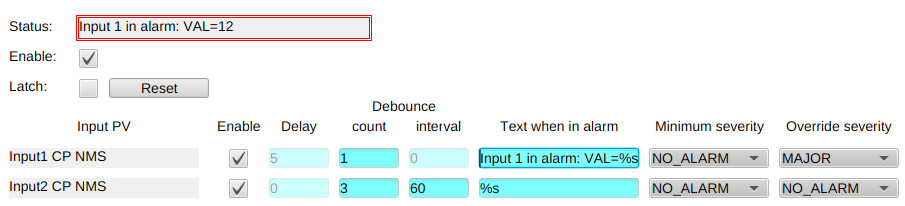

# EPICS alarmRecord

The Alarm record is used to provide contextual text description of the most
significant alarm from up to 25 other linked records. The alarm mechanism is
similar to other standard records with multiple inputs, except that it allows
remote links to go invalid and still not necessarily trigger the alarm. Whenever
the record processes, it scans all linked records for alarms. Alarmed link with
highest severity drives the severity of the Alarm record. Minimum and override
severity fields allow to fine tune the alarming mechanism of the links.
Debouncing mechanism and minimum time in alarm provide way to filter out noise
or intermittent alarms. Each link could be individually enabled or disabled.
Finally, the global settings allow for Alarm record to latch status until
cleared manually or disable the record completely.

## Global record fields

VAL field contains textual description of the alarm. Its value is determined by the link that is in
alarm. When no alarm, the initial value is displayed.

LCH is a menuYesNo switch to turn on/off latching of the alarm state. As soon as any link enters 
alarm state, the record's STAT, SEVR and VAL field will update and freeze.

Writing 1 to CLR field will clear the latched state of record. This effectively means clearing STAT,
SEVR and VAL fields. If any link is in alarm state.

EN field is menuYesNo switch to enable or disable this record.

## Link fields

Alarm records supports up to 10 individual input links to be aggregated. For each link there are
number of fields that control how each link affects the record.

ENx is a menuYesNo switch which enables or disables checking this link. Default is 0.

INPx specifies linked record. All link modifiers are supported, like CP, NMS etc.

STRx specifies custom text to be displayed when this link is driving the
record's alarm. Certain modifiers are replaced at runtime with corresponding
link fields. Modifiers supported: %VAL%, %EGU%

OSVx allows to override the remote record's severity. Value of 0 means use
remote record's severity.

MSVx specifies the minimum severity of the remote record in order to trigger.
Value of 0 is not valid but is kept for compliancy with other SEVR records.

DLCx stands for debounce minimum count and when >1 it specifies how many times
the connected record must enter the alarm during interval specified in DLIx.

DLIx is debounce interval in seconds.

DLYx allows to configure minimum time in seconds before this link triggers the
record alarm. This confiuration is only valid when DLCx=1.

ACTx specifies the status of currently activated link alarm, after debouncing
and delay conditions have been met.